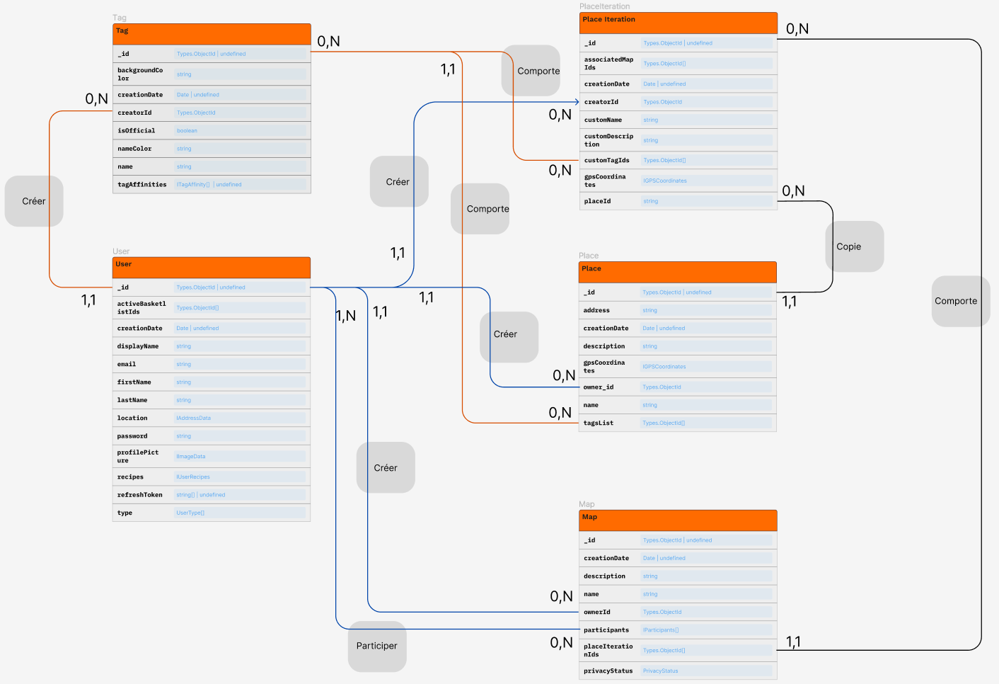
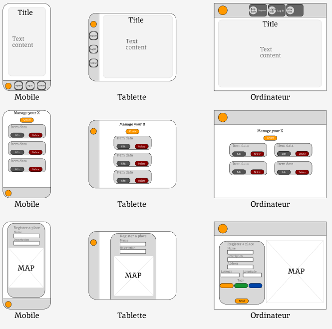
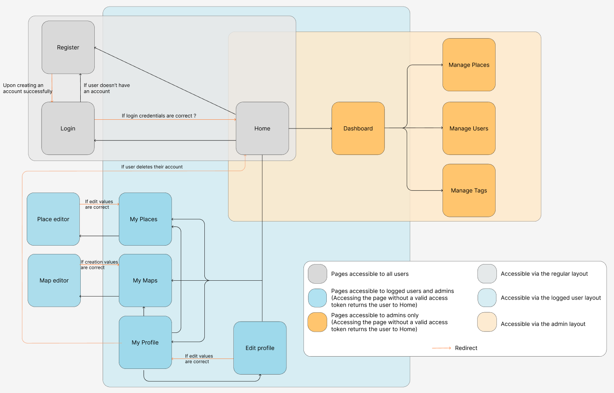

# Projet de soutenance - Marketplates

Marketplates est un site qui a la vocation de rassembler des cartes crées par des utilisateurs contenant leur version et opinion de lieu de restauration déjà existants. Le MVP qui sert pour le rendu de cette soutenance peut être trouvé ici : [Marketplates](https://marketplates.netlify.app/)

## Liens repositories
[Repository Front](https://github.com/Graeimh/marketplates-front)

[Repository Back](https://github.com/Graeimh/marketplates)

## Schemas
UML

Wireframes

Schéma de navigation

## Documents
[Diaporama](https://docs.google.com/presentation/d/1w8-RcXcFjlpHYvRrf5fkYV-Hl7TelG4UHeavRYPP6dM/edit?usp=sharing)

[Lien vers le dump de la database (MongoDB)](resources/dumps/) 
